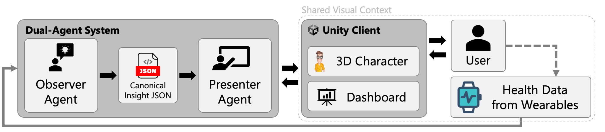
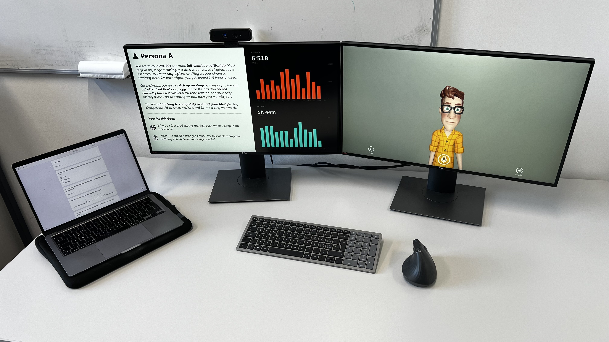

# Talking to Your Data: User Study Repository

## System Overview



## About This Research

This repository contains the user study materials for the paper:

**"Talking to Your Data: Exploring Embodied Conversation as an Interface for Personal Health Reflection"**

### Authors
<i><b>Nikola Kovacevic<sup>1,&#42;</sup>, Bastien Husler<sup>1</sup>, Di Zhuang<sup>1</sup>, Rafael Wampfler<sup>1,&#42;</sup>, and Barbara Solenthaler<sup>1,&#42;</sup></b></i>

<sup>1</sup>Department of Computer Science, ETH Zurich, Zurich, Switzerland

<sup>*</sup>Corresponding authors

### Abstract

Personal health data from wearables are typically presented through dashboards of charts and summary statistics, requiring users to actively interpret patterns and implications. We explore an alternative interaction paradigm: engaging with personal health data through an embodied conversational agent that facilitates objective data reflection in dialogue with the user.

We present a system that combines lightweight preprocessing of wearable data with a Unity-based embodied character. The system follows a dual-agent design: an Observer agent extracts descriptive statistics and temporal trends, while a Presenter agent communicates findings through "spoken statistics," refraining from clinical advice to isolate the impact of the interaction modality.

Our evaluation through a simulated-self user study (N=5) uses a within-subject design. Participants adopted health personas and goals from the LifeSnaps dataset to compare traditional dashboard exploration with embodied conversational reflection, focusing on perceived understanding, specificity of generated actions, and the cognitive shift from passive viewing to active sensemaking.

The paper contributes a functional prototype, a design pattern for objective health data narrative generation, and early empirical insights into how embodiment affects the interpretation of personal health metrics.

---

## Repository Contents

This repository is organized to contain all materials necessary to reproduce and understand the user study:


### Questionnaires
- [Entry Questionnaire](questionnaires/entry_questionnaire.tex) – Collects demographic and technology background information prior to the study.
- [Post-Condition Questionnaire](questionnaires/post_condition_questionnaire.tex) – Measures perceived understanding, actionability, engagement, trust, and social presence after each condition.
- [Exit Questionnaire](questionnaires/exit_questionnaire.tex) – Comparative preferences and semi-structured interview prompts for the conversational agent vs. dashboard interface.


### Personas
- [Persona A](personas/persona_A.md) – sedentary / sleep-deprived profile with goals about daytime tiredness and small realistic changes to improve activity and sleep.
- [Persona B](personas/persona_B.md) – active / stressed student profile with goals about soreness/recovery and routine/training adjustments.


### Prompts
- [Observer Prompt](prompts/observer_prompt.txt) – System prompt for the Observer agent that analyzes raw step and sleep data to extract personalized health insights with confidence scores.
- [Presenter Prompt](prompts/presenter_prompt.txt) – System prompt for the Presenter agent (Vincent) that communicates insights conversationally, grounded in data and focused on user reflection.


### Source Code
Processing pipelines for the user study. See [src/README.md](src/README.md) for documentation.
- **Persona Extraction** – Pipeline for extracting 14-day windows from the LifeSnaps dataset based on activity and sleep criteria.
- **Statistics & Insights Generation** – Tools to compute correlations, trends, and weekday patterns from persona data, and generate filled observer prompts for LLM-based insight generation.


### Study Setup



The user study employs a two-screen setup:
- **Left monitor** – Displays the persona description and health goals, along with a dashboard showing step count and sleep data visualizations.
- **Right monitor** – Shows the Unity-based embodied conversational agent (Vincent) that participants interact with during the conversational condition.
- **MacBook** – Used for questionnaire administration, kept separate from the main interaction screens.


## Citation

If you use this pipeline in your research, please cite:

```
[TBD]
```